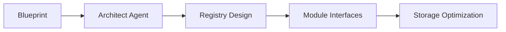
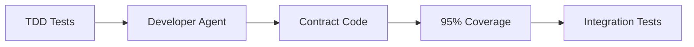
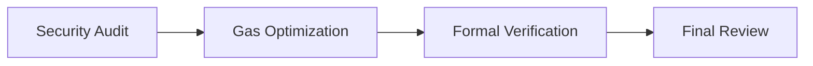

# BMad Blockchain Development Expansion Pack

> **Path Update (Nov 2025):** This Hardhat workspace previously lived at `packages/blockchain/` inside the monorepo. It now resides under `contracts/blockchain/` so the Next.js frontend can occupy the repository root.

## 🚀 KEKTECH 3.0 Smart Contract Development Framework

A specialized BMad expansion pack for blockchain development, optimized for the KEKTECH 3.0 prediction market ecosystem on BasedAI Chain (Chain ID: 32323).

## 📋 Overview

This expansion pack provides 7 specialized AI agents for comprehensive blockchain development:

- **🏛️ Blockchain Architect**: System design and architecture
- **💻 Solidity Developer**: Smart contract implementation with TDD
- **🛡️ Security Auditor**: Vulnerability assessment and formal verification
- **⛽ Gas Optimizer**: Performance optimization and cost reduction
- **🚀 Deployment Orchestrator**: Contract deployment and verification
- **📊 Economic Modeler**: Token economics and fee optimization
- **🗳️ Governance Coordinator**: DAO transition and proposal management

## 🎯 Quick Start

### Prerequisites

```bash
# Install Node.js (v16+)
node --version

# Install required tools
npm install -g hardhat
```

### Installation

```bash
# Clone or navigate to expansion pack
cd expansion-packs/bmad-blockchain-dev

# Install dependencies
npm install

# Copy environment template
cp .env.template .env
# Edit .env with your configuration
```

### First Deployment (V0 Bootstrap)

```bash
# 1. Compile contracts
npm run compile

# 2. Run tests (TDD mandatory!)
npm test

# 3. Start local node
npm run node

# 4. Deploy to local network
npm run deploy:local

# 5. Check gas report
npm run test:gas
```

## 🤖 Agent Usage

### In Your IDE (Claude Code/Cursor)

```bash
# Load Blockchain Architect
/bmad-bc/architect
"Design the Master Registry for KEKTECH 3.0"

# Load Solidity Developer
/bmad-bc/solidity
"Implement MasterRegistry with TDD"

# Load Security Auditor
/bmad-bc/security
"Audit the MasterRegistry implementation"

# Load Gas Optimizer
/bmad-bc/gas
"Optimize MasterRegistry gas consumption"

# Load Deployment Orchestrator
/bmad-bc/deploy
"Deploy contracts to BasedAI testnet"
```

### Workflow Commands

```bash
# Start V0 Bootstrap workflow
/bmad-bc/workflow v0-bootstrap

# Start V1 Mainnet launch workflow
/bmad-bc/workflow v1-launch

# Module upgrade workflow
/bmad-bc/workflow upgrade
```

## 📁 Project Structure

```
bmad-blockchain-dev/
├── agents/              # AI agent configurations
│   ├── blockchain-architect.md
│   ├── solidity-developer.md
│   ├── security-auditor.md
│   ├── gas-optimizer.md
│   ├── deployment-orchestrator.md
│   ├── economic-modeler.md
│   └── governance-coordinator.md
├── contracts/           # Solidity smart contracts
│   ├── MasterRegistry.sol
│   ├── ParameterStorage.sol
│   ├── AccessControlManager.sol
│   ├── markets/
│   │   ├── FlexibleMarketFactory.sol
│   │   └── PredictionMarket.sol
│   ├── governance/
│   │   └── ProposalManager.sol
│   ├── resolution/
│   │   └── ResolutionManager.sol
│   └── rewards/
│       └── RewardDistributor.sol
├── tests/               # Comprehensive test suites
│   └── *.test.js
├── scripts/             # Deployment and utility scripts
│   ├── deploy-v0.js
│   ├── deploy-testnet.js
│   └── deploy-mainnet.js
├── workflows/           # Agent orchestration workflows
│   ├── kektech-v0-bootstrap.yaml
│   ├── kektech-v1-launch.yaml
│   └── module-upgrade.yaml
├── templates/           # Contract and document templates
│   └── master-registry-spec.md
├── hardhat.config.js    # Hardhat configuration
├── package.json         # Project dependencies
└── README.md           # This file
```

## 🔄 Development Workflow

### Phase 1: Architecture & Design (Days 1-3)


### Phase 2: Implementation (Days 4-10)


### Phase 3: Security & Optimization (Days 11-14)


## 🎯 KEKTECH Module Overview

| Module | Purpose | Gas Target |
|--------|---------|------------|
| MasterRegistry | Central contract directory | <50k update |
| ParameterStorage | Configuration management | <30k read |
| AccessControlManager | Role-based permissions | <40k check |
| FlexibleMarketFactory | Create prediction markets | <200k create |
| PredictionMarket | Binary betting logic | <100k bet |
| ProposalManager | Market proposals | <150k propose |
| ResolutionManager | Market outcome resolution | <150k resolve |
| RewardDistributor | Fee distribution | <80k claim |

## 📊 Testing Requirements

### Mandatory TDD Process
```javascript
// 1. ALWAYS write test first
describe("MasterRegistry", function() {
    it("Should update contract address", async function() {
        // Test implementation
    });
});

// 2. Then implement to pass the test
function setContract(bytes32 key, address addr) {
    // Implementation
}
```

### Coverage Requirements
- **Core Contracts**: 100% coverage
- **Market Modules**: 95% minimum
- **Helper Functions**: 90% minimum

## ⛽ Gas Optimization Targets

| Operation | Target Gas | Actual | Status |
|-----------|------------|--------|--------|
| placeBet | <100k | - | Pending |
| createMarket | <200k | - | Pending |
| resolveMarket | <150k | - | Pending |
| claimWinnings | <80k | - | Pending |
| updateParameter | <50k | - | Pending |

## 🔐 Security Checklist

- [ ] All functions have access control
- [ ] Reentrancy guards on state changes
- [ ] No arithmetic overflow possible
- [ ] Events emitted for all state changes
- [ ] Emergency pause mechanism tested
- [ ] Formal verification complete
- [ ] Slither analysis passed
- [ ] Mythril scan clean

## 🚀 Deployment Guide

### Local Development
```bash
# Start local node
npx hardhat node

# Deploy
npx hardhat run scripts/deploy-v0.js --network localhost
```

### BasedAI Testnet
```bash
# Configure .env with testnet RPC and private key

# Deploy
npm run deploy:testnet

# Verify
npm run verify:testnet CONTRACT_ADDRESS
```

### BasedAI Mainnet
```bash
# CRITICAL: Review checklist first!
# - [ ] All tests passing
# - [ ] Security audit complete
# - [ ] Gas optimization done
# - [ ] Multisig configured

npm run deploy:mainnet
```

## 📈 Roadmap

### V0: Bootstrap (Weeks 1-2)
- [x] Core architecture
- [x] Master Registry
- [ ] All modules implemented
- [ ] Local deployment successful

### V1: Testnet (Weeks 3-4)
- [ ] Testnet deployment
- [ ] Community testing
- [ ] Bug bounty program
- [ ] Performance validation

### V2: Mainnet (Month 2)
- [ ] Professional audit
- [ ] Mainnet deployment
- [ ] Vultisig multisig
- [ ] Monitoring setup

### V3: DAO (Month 3)
- [ ] Governance implementation
- [ ] Progressive decentralization
- [ ] Community proposals
- [ ] Full DAO control

## 🛠️ Troubleshooting

### Common Issues

**Issue**: Compilation errors
```bash
# Solution: Clear cache and recompile
npx hardhat clean
npx hardhat compile
```

**Issue**: Test failures
```bash
# Solution: Reset local node
npx hardhat node --reset
npm test
```

**Issue**: Gas limit exceeded
```bash
# Solution: Increase gas limit in hardhat.config.js
networks: {
  hardhat: {
    gas: 12000000
  }
}
```

## 📚 Resources

- [KEKTECH Blueprint](../../KEKTECH_3.0_Refined_Blueprint_v1.md)
- [BasedAI Documentation](https://docs.basedai.io)
- [Solidity Documentation](https://docs.soliditylang.org)
- [Hardhat Documentation](https://hardhat.org/docs)
- [OpenZeppelin Contracts](https://docs.openzeppelin.com/contracts)

## 🤝 Contributing

1. Fork the repository
2. Create feature branch (`git checkout -b feature/amazing-feature`)
3. Write tests first (TDD mandatory!)
4. Implement feature
5. Ensure 95%+ coverage
6. Commit changes (`git commit -m 'Add amazing feature'`)
7. Push branch (`git push origin feature/amazing-feature`)
8. Open Pull Request

## 📄 License

MIT License - see LICENSE file for details

## 🙏 Acknowledgments

- KEKTECH Team for the vision
- BasedAI for the blockchain platform
- BMad Framework for agent orchestration
- OpenZeppelin for security patterns

---

**Built with ❤️ for the decentralized future of prediction markets**
