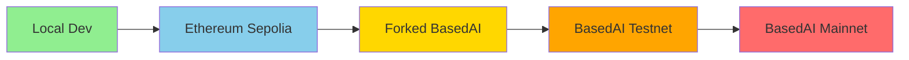
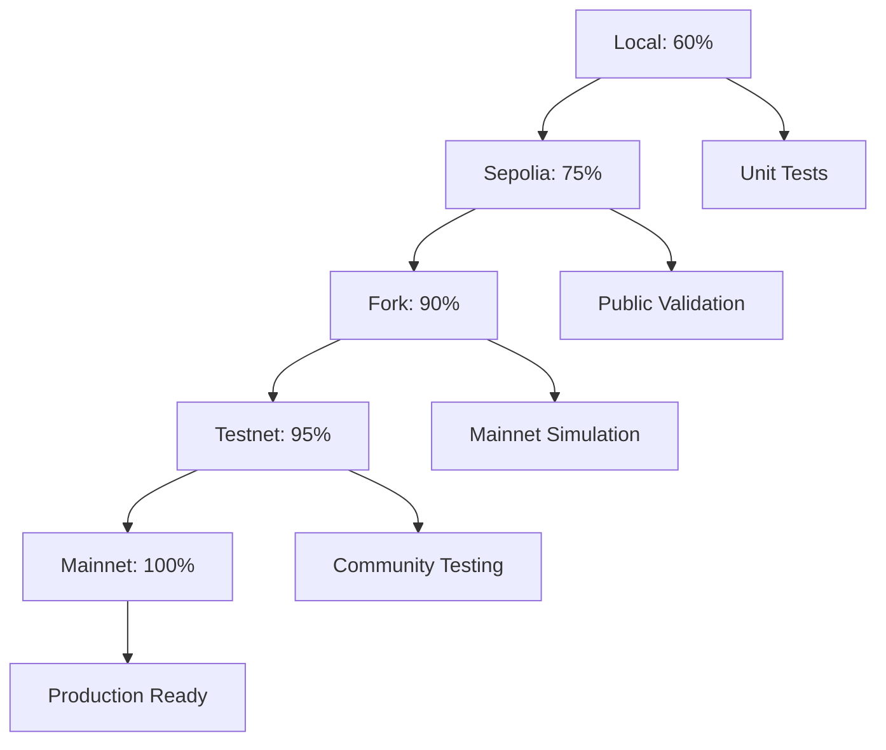

# 🌐 Multi-Network Testing Guide for KEKTECH 3.0

## Overview

This guide explains the progressive multi-network testing strategy for KEKTECH 3.0, leveraging **5 different networks** to achieve comprehensive validation with optimal cost efficiency.

## 🎯 Network Strategy

### Testing Pipeline



### Network Comparison

| Network | Purpose | Cost | Speed | Confidence | When to Use |
|---------|---------|------|-------|------------|-------------|
| **Local** | Unit Testing | $0 | Instant | 60% | Every change |
| **Sepolia** | Public Testing | ~$0.01 | 15s blocks | 75% | Daily |
| **Fork** | Mainnet Simulation | $0 | Instant | 90% | Pre-deployment |
| **Testnet** | Final Validation | $0 | 2s blocks | 95% | Pre-mainnet |
| **Mainnet** | Production | Real $BASED | 2s blocks | 100% | Launch |

## 🚀 Quick Start

### 1. Setup Environment

```bash
# Clone and setup
cd expansion-packs/bmad-blockchain-dev

# Install dependencies
npm install

# Copy environment file
cp .env.template .env
# Edit .env with your keys

# Install Foundry (for advanced testing)
curl -L https://foundry.paradigm.xyz | bash
foundryup
```

### 2. Progressive Testing Flow

#### Phase 1: Local Development (Every Change)

```bash
# Start local node
npm run node

# In new terminal, run tests
npm test

# Check gas usage
npm run test:gas

# Run Foundry fuzz tests
forge test --fuzz-runs 1000
```

**Success Criteria:**
- ✅ All tests passing
- ✅ 95% coverage
- ✅ Gas within targets

#### Phase 2: Sepolia Testing (Daily)

```bash
# Get Sepolia ETH from faucet
# https://sepoliafaucet.com

# Deploy to Sepolia
npm run deploy:sepolia

# Run integration tests
npm run test:sepolia

# Verify contracts
npm run verify:sepolia CONTRACT_ADDRESS
```

**Success Criteria:**
- ✅ Deployment successful
- ✅ Contracts verified
- ✅ Integration tests pass

#### Phase 3: Fork Testing (Pre-Deployment)

```bash
# Start forked node
npm run node:fork

# In new terminal, deploy
npm run deploy:fork

# Run fork-specific tests
npm run test:fork

# Foundry fork tests
forge test --fork-url http://localhost:8545
```

**Benefits of Fork Testing:**
- 🎯 Real mainnet state
- 💰 Zero cost
- ⚡ Time manipulation
- 🔄 Snapshot/revert
- 👤 Impersonate accounts

#### Phase 4: TestNet Validation (Pre-Mainnet)

```bash
# Deploy to BasedAI testnet
npm run deploy:testnet

# Community testing period (24-48h)
# Monitor for issues

# Final security check
npm run security:slither
npm run security:mythril
```

**Success Criteria:**
- ✅ No critical bugs found
- ✅ Community approval
- ✅ Security audit passed

#### Phase 5: Mainnet Deployment (Production)

```bash
# CRITICAL: Complete checklist first!
# □ All tests passing
# □ Audit complete
# □ Multisig ready
# □ Team approval

# Deploy to mainnet
npm run deploy:mainnet

# Verify contracts
npm run verify:mainnet CONTRACT_ADDRESS

# Transfer ownership to multisig
# (handled in deployment script)
```

## 🔧 Network Configuration

### Hardhat Config

```javascript
// hardhat.config.js
networks: {
  // Local development
  localhost: {
    url: "http://127.0.0.1:8545"
  },

  // Cheap public testing
  sepolia: {
    url: process.env.SEPOLIA_RPC,
    chainId: 11155111
  },

  // Mainnet simulation
  forkedBasedAI: {
    url: "http://127.0.0.1:8545",
    forking: {
      url: process.env.BASEDAI_MAINNET_RPC,
      blockNumber: process.env.FORK_BLOCK_NUMBER
    }
  },

  // Final testing
  basedai_testnet: {
    url: process.env.BASEDAI_TESTNET_RPC,
    chainId: 32324
  },

  // Production
  basedai_mainnet: {
    url: process.env.BASEDAI_MAINNET_RPC,
    chainId: 32323
  }
}
```

### Environment Variables

```bash
# .env file

# Sepolia
SEPOLIA_RPC=https://rpc.sepolia.org

# BasedAI
BASEDAI_MAINNET_RPC=https://rpc.bf1337.org
BASEDAI_TESTNET_RPC=https://testnet-rpc.basedai.io

# Fork settings
FORK_BLOCK_NUMBER=latest

# Keys (use different for each network!)
PRIVATE_KEY=0x...
MAINNET_MULTISIG=0x...
```

## 💰 Cost Optimization

### Network Cost Analysis

| Operation | Local | Sepolia | Fork | Testnet | Mainnet |
|-----------|-------|---------|------|---------|---------|
| Deploy All | $0 | ~$0.50 | $0 | $0 | ~$50 |
| 100 Tests | $0 | ~$1.00 | $0 | $0 | ~$100 |
| Unlimited | ✅ | ❌ | ✅ | ✅* | ❌ |

*Testnet may have rate limits

### Cost-Saving Strategies

1. **Do 90% of testing on Local/Fork**
   - Unlimited free transactions
   - Instant feedback
   - No rate limits

2. **Use Sepolia for public verification**
   - Minimal ETH needed
   - Public block explorer
   - Real network conditions

3. **Fork for mainnet simulation**
   - Test with real $BASED state
   - Verify gas costs
   - Check integrations

4. **Batch operations on expensive networks**
   - Combine multiple tests
   - Use multicall patterns
   - Optimize gas before mainnet

## 🔍 Fork Testing Deep Dive

### Why Fork Testing is Powerful

Fork testing creates a local copy of the entire blockchain state, allowing you to:

1. **Test with Real Data**
   ```javascript
   // Interact with real mainnet contracts
   const realUSDC = await ethers.getContractAt(
     "IERC20",
     "0xA0b86991c6218b36c1d19D4a2e9Eb0cE3606eB48" // Real USDC
   );
   ```

2. **Impersonate Accounts**
   ```javascript
   // Become any address (like Vitalik!)
   await hre.network.provider.request({
     method: "hardhat_impersonateAccount",
     params: ["0xd8dA6BF26964aF9D7eEd9e03E53415D37aA96045"]
   });
   ```

3. **Time Travel**
   ```javascript
   // Fast forward 30 days
   await network.provider.send("evm_increaseTime", [30 * 24 * 60 * 60]);
   await network.provider.send("evm_mine");
   ```

4. **Snapshot & Revert**
   ```javascript
   // Save state
   const snapshot = await network.provider.send("evm_snapshot");

   // Do dangerous stuff...

   // Revert to saved state
   await network.provider.send("evm_revert", [snapshot]);
   ```

### Fork Testing Commands

```bash
# Start fork with specific block
npx hardhat node --fork https://rpc.bf1337.org --fork-block-number 12345678

# Run tests against fork
npx hardhat test --network forkedBasedAI

# Use our helper script
node scripts/utils/fork-setup.js
```

## 🛡️ Security Considerations

### Network-Specific Security

1. **Sepolia**: Use separate test wallets
2. **Fork**: No real funds at risk
3. **Testnet**: May have value if tokens tradeable
4. **Mainnet**: Use hardware wallets + multisig

### Key Management

```bash
# Different keys per network
SEPOLIA_PRIVATE_KEY=0x... # Disposable test key
FORK_PRIVATE_KEY=0x...     # Local only
TESTNET_PRIVATE_KEY=0x...  # Separate test key
MAINNET_PRIVATE_KEY=0x...  # SECURE - Hardware wallet
```

## 📊 Testing Metrics

### Coverage Requirements

| Network | Unit Tests | Integration | Fuzz | Security |
|---------|------------|-------------|------|----------|
| Local | 95% | 90% | 1000 runs | Basic |
| Sepolia | - | 95% | - | Slither |
| Fork | 95% | 95% | 10000 runs | Full |
| Testnet | - | 100% | - | Audit |
| Mainnet | - | - | - | Verified |

### Performance Targets

| Operation | Target Gas | Max Latency | Success Rate |
|-----------|------------|-------------|--------------|
| placeBet | <100k | 2s | 99.9% |
| createMarket | <200k | 3s | 99.9% |
| resolveMarket | <150k | 2s | 99.9% |
| claimWinnings | <80k | 2s | 99.9% |

## 🚨 Troubleshooting

### Common Issues

#### Fork Not Starting
```bash
# Check if port 8545 is in use
lsof -i :8545

# Kill existing process
kill -9 <PID>

# Restart fork
npm run node:fork
```

#### Sepolia Faucet Issues
```bash
# Alternative faucets
# https://faucet.sepolia.dev/
# https://sepoliafaucet.com/
# https://faucet.chainlink.com/sepolia
```

#### Gas Estimation Errors
```javascript
// Add gas buffer for complex operations
const tx = await contract.method({
  gasLimit: estimatedGas.mul(120).div(100) // 20% buffer
});
```

## 📈 Progressive Validation

### Confidence Levels



### When to Progress

Move to next network when:
- ✅ All tests passing
- ✅ No blocking issues
- ✅ Team consensus
- ✅ Documentation updated

## 🎯 Best Practices

1. **Always test on fork before mainnet**
   - Catches mainnet-specific issues
   - Validates gas costs
   - Tests real integrations

2. **Use network tags in deployment**
   ```javascript
   if (network.tags.includes("testnet")) {
     // Testnet-specific logic
   }
   ```

3. **Document network-specific behavior**
   ```javascript
   // Works on mainnet, fails on testnet due to missing contract
   const oracle = network.name === "mainnet"
     ? MAINNET_ORACLE
     : MOCK_ORACLE;
   ```

4. **Automate network progression**
   ```bash
   # CI/CD pipeline
   npm run test:local && \
   npm run deploy:sepolia && \
   npm run test:sepolia && \
   npm run deploy:fork && \
   npm run test:fork
   ```

## 📚 Resources

- [Ethereum Sepolia Faucet](https://sepoliafaucet.com)
- [BasedAI Documentation](https://docs.basedai.io)
- [Hardhat Forking Guide](https://hardhat.org/hardhat-network/docs/guides/forking-other-networks)
- [Foundry Book](https://book.getfoundry.sh)

## 🤝 Support

Need help with multi-network testing?

- GitHub Issues: [Report problems](https://github.com/kektech/issues)
- Discord: [Join community](https://discord.gg/kektech)
- Documentation: [Read the docs](https://docs.kektech.io)

---

**Remember**: The best bug is the one caught on a cheap network! 🐛💰