# 🔄 Market Lifecycle State Diagram

**Version**: 1.0.0
**Last Updated**: Day 25 (Phase 5.2 Complete)
**Status**: ✅ Production Ready

---

## Complete State Transition Diagram

---

## Simplified Flow Diagram

```mermaid
flowchart TD
    A[Market Created] --> B{Approved?}
    B -->|Yes| C[PROPOSED → APPROVED]
    B -->|No| D[PROPOSED → FINALIZED]

    C --> E{Activated?}
    E -->|Yes| F[APPROVED → ACTIVE]
    E -->|No| D

    F --> G{Trading Period}
    G --> H[End Time Reached]

    H --> I[ACTIVE → RESOLVING]
    I --> J{Disputed?}
    J -->|No| K[RESOLVING → FINALIZED]
    J -->|Yes| L[RESOLVING → DISPUTED]
    L --> M[DISPUTED → FINALIZED]

    K --> N[Winners Claim]
    M --> N
    D --> N

    style F fill:#90EE90
    style K fill:#FFD700
    style M fill:#FFD700
    style D fill:#FF6B6B
```

---

## State Transition Table

| Current State | Valid Next States | Transition Function | Access Control |
|--------------|-------------------|---------------------|----------------|
| **PROPOSED** | APPROVED, FINALIZED | approve(), reject() | Factory only |
| **APPROVED** | ACTIVE, FINALIZED | activate(), reject() | Factory only |
| **ACTIVE** | RESOLVING, FINALIZED | proposeOutcome(), adminCancel() | Resolver, Admin |
| **RESOLVING** | FINALIZED, DISPUTED | finalize(), dispute() | Auto, Users |
| **DISPUTED** | FINALIZED | adminResolve() | Admin only |
| **FINALIZED** | None (terminal) | N/A | N/A |

---

## Implementation Status

### ✅ Implemented Transitions

**Status**: Production ready, fully tested (14 tests passing)

---

### ⏸️ Pending Implementation

**Status**: Awaiting Phase 5 completion (4 tests pending)

---

## Transition Decision Tree

---

## Access Control Flow

```mermaid
sequenceDiagram
    participant User
    participant Factory
    participant Market
    participant Admin

    User->>Factory: createMarket()
    Factory->>Market: initialize()
    Market-->>Market: Set PROPOSED

    Admin->>Factory: approveMarket()
    Factory->>Market: approve()
    Market-->>Market: PROPOSED → APPROVED

    Admin->>Factory: activateMarket()
    Factory->>Market: activate()
    Market-->>Market: APPROVED → ACTIVE

    Note over Market: Trading Period

    User->>Market: placeBet()
    Market-->>Market: Verify ACTIVE state
    Market-->>User: Bet placed

    Note over Market: End Time Reached

    Market-->>Market: ACTIVE → RESOLVING (pending)
    Market-->>Market: RESOLVING → FINALIZED (pending)

    User->>Market: claimWinnings()
    Market-->>Market: Verify FINALIZED
    Market-->>User: Winnings paid
```

---

## Error Handling Flow

---

## Frontend Integration Flow

---

## State Duration Timeline

**Typical Durations**:
- PROPOSED: 0-48 hours
- APPROVED: 0-24 hours
- ACTIVE: Variable (defined by market creator, typically 7-90 days)
- RESOLVING: 24-72 hours (dispute window)
- DISPUTED: Variable (admin review time)
- FINALIZED: Permanent (terminal state)

---

## Complete Lifecycle Example

---

## References

- **Main Documentation**: `MARKET_LIFECYCLE.md`
- **Contract**: `contracts/core/PredictionMarket.sol`
- **Tests**: `test/hardhat/PredictionMarketLifecycle.test.js`
- **Phase Docs**: `docs/migration/PHASE_5_MARKET_LIFECYCLE.md`

---

**Diagram Version**: 1.0.0
**Mermaid Version**: 10.6+
**Status**: ✅ Production Ready
