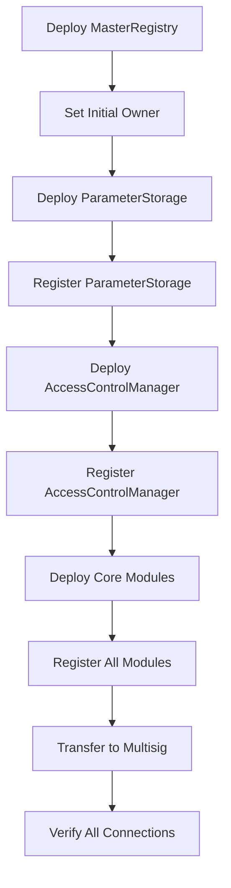

# Master Registry Specification

## Overview

The Master Registry serves as the central directory and configuration hub for the entire KEKTECH 3.0 ecosystem. It provides a single source of truth for module addresses, enabling seamless upgrades without proxy patterns.

## Contract Architecture

```solidity
// SPDX-License-Identifier: MIT
pragma solidity ^0.8.19;

interface IMasterRegistry {
    // Events
    event ContractUpdated(
        bytes32 indexed key,
        address indexed newAddress,
        address indexed oldAddress,
        uint256 timestamp
    );

    event OwnershipTransferred(
        address indexed previousOwner,
        address indexed newOwner
    );

    event RegistryPaused(bool isPaused);
    event EmergencyActionExecuted(string action, address executor);

    // Core Functions
    function setContract(bytes32 key, address contractAddress) external;
    function getContract(bytes32 key) external view returns (address);
    function removeContract(bytes32 key) external;
    function contractExists(bytes32 key) external view returns (bool);

    // Batch Operations
    function batchSetContracts(
        bytes32[] calldata keys,
        address[] calldata addresses
    ) external;

    // Admin Functions
    function transferOwnership(address newOwner) external;
    function pause() external;
    function unpause() external;

    // View Functions
    function owner() external view returns (address);
    function paused() external view returns (bool);
    function version() external view returns (uint256);
    function getAllContracts() external view returns (
        bytes32[] memory keys,
        address[] memory addresses
    );
}
```

## Storage Layout (Gas Optimized)

```solidity
contract MasterRegistry is IMasterRegistry {
    // Slot 0: Core admin data (32 bytes)
    address public owner;                  // 20 bytes
    bool public paused;                    // 1 byte
    uint88 public version;                 // 11 bytes

    // Slot 1: Counters (32 bytes)
    uint128 public totalContracts;         // 16 bytes
    uint128 public lastUpdateTimestamp;    // 16 bytes

    // Slot 2+: Main registry mapping
    mapping(bytes32 => address) private contracts;

    // Slot N: Enumeration support
    bytes32[] private contractKeys;
    mapping(bytes32 => uint256) private keyIndex;

    // Constants (no storage)
    bytes32 public constant PARAMETER_STORAGE = keccak256("PARAMETER_STORAGE");
    bytes32 public constant ACCESS_CONTROL = keccak256("ACCESS_CONTROL");
    bytes32 public constant MARKET_FACTORY = keccak256("MARKET_FACTORY");
    bytes32 public constant PROPOSAL_MANAGER = keccak256("PROPOSAL_MANAGER");
    bytes32 public constant RESOLUTION_MANAGER = keccak256("RESOLUTION_MANAGER");
    bytes32 public constant REWARD_DISTRIBUTOR = keccak256("REWARD_DISTRIBUTOR");
    bytes32 public constant TREASURY = keccak256("TREASURY");
}
```

## Module Integration Pattern

### For Each Module

```solidity
contract ExampleModule {
    IMasterRegistry public immutable registry;
    bytes32 public constant MODULE_NAME = keccak256("EXAMPLE_MODULE");

    constructor(address _registry) {
        require(_registry != address(0), "Invalid registry");
        registry = IMasterRegistry(_registry);
    }

    modifier onlyAdmin() {
        address accessControl = registry.getContract(
            keccak256("ACCESS_CONTROL")
        );
        require(
            IAccessControl(accessControl).hasRole(ADMIN_ROLE, msg.sender),
            "Not admin"
        );
        _;
    }

    function getParameterStorage() internal view returns (IParameterStorage) {
        return IParameterStorage(
            registry.getContract(keccak256("PARAMETER_STORAGE"))
        );
    }
}
```

## Gas Analysis

| Operation | Gas Cost | Optimization |
|-----------|----------|--------------|
| setContract (first time) | ~45,000 | Use batch operations |
| setContract (update) | ~28,000 | Cache frequently used |
| getContract | ~2,600 | Use immutable when possible |
| batchSetContracts (5) | ~180,000 | 20% savings vs individual |
| transferOwnership | ~25,000 | Two-step process recommended |

## Security Considerations

### Access Control
- [ ] Only owner can update registry
- [ ] Two-step ownership transfer pattern
- [ ] Emergency pause mechanism
- [ ] Time-locked updates for critical modules

### Validation
- [ ] Zero address checks
- [ ] Duplicate prevention
- [ ] Contract existence verification
- [ ] Interface compliance checks

### Upgrade Safety
- [ ] Old contract address logged in events
- [ ] Migration scripts for stateful upgrades
- [ ] Rollback capability
- [ ] Gradual migration support

## Deployment Sequence



## Testing Requirements

### Unit Tests
- [ ] All functions with edge cases
- [ ] Access control validation
- [ ] Event emission verification
- [ ] Gas consumption benchmarks

### Integration Tests
- [ ] Module registration flow
- [ ] Cross-module communication
- [ ] Upgrade scenarios
- [ ] Emergency procedures

### Invariant Tests
- [ ] Registry consistency
- [ ] No orphaned modules
- [ ] Access control integrity
- [ ] Version consistency

## Implementation Checklist

### Phase 1: Core Registry
- [ ] Implement IMasterRegistry interface
- [ ] Add storage variables (optimized layout)
- [ ] Implement setContract with validations
- [ ] Implement getContract with caching
- [ ] Add batch operations

### Phase 2: Admin Functions
- [ ] Two-step ownership transfer
- [ ] Pause/unpause mechanism
- [ ] Emergency functions
- [ ] Version management

### Phase 3: Integration
- [ ] Module connection testing
- [ ] Event monitoring setup
- [ ] Documentation completion
- [ ] Deployment scripts

## Version History

| Version | Changes | Migration Required |
|---------|---------|-------------------|
| 1.0.0 | Initial deployment | N/A |
| 1.1.0 | Add batch operations | No |
| 1.2.0 | Add enumeration support | No |
| 2.0.0 | Optimize storage layout | Yes |

## Code Example: Complete Implementation

```solidity
// SPDX-License-Identifier: MIT
pragma solidity ^0.8.19;

contract MasterRegistry is IMasterRegistry {
    // Storage layout optimized for gas efficiency
    address public owner;                  // Slot 0: 20 bytes
    bool public paused;                    // Slot 0: 1 byte
    uint88 public version = 1;            // Slot 0: 11 bytes

    uint128 public totalContracts;        // Slot 1: 16 bytes
    uint128 public lastUpdateTimestamp;   // Slot 1: 16 bytes

    mapping(bytes32 => address) private contracts;
    bytes32[] private contractKeys;
    mapping(bytes32 => uint256) private keyIndex;

    modifier onlyOwner() {
        require(msg.sender == owner, "Not owner");
        _;
    }

    modifier whenNotPaused() {
        require(!paused, "Registry paused");
        _;
    }

    constructor() {
        owner = msg.sender;
        lastUpdateTimestamp = uint128(block.timestamp);
    }

    function setContract(bytes32 key, address contractAddress)
        external
        onlyOwner
        whenNotPaused
    {
        require(contractAddress != address(0), "Zero address");
        require(key != bytes32(0), "Invalid key");

        address oldAddress = contracts[key];

        if (oldAddress == address(0)) {
            // New contract
            contractKeys.push(key);
            keyIndex[key] = contractKeys.length;
            totalContracts++;
        }

        contracts[key] = contractAddress;
        lastUpdateTimestamp = uint128(block.timestamp);

        emit ContractUpdated(key, contractAddress, oldAddress, block.timestamp);
    }

    function getContract(bytes32 key) external view returns (address) {
        address contractAddress = contracts[key];
        require(contractAddress != address(0), "Contract not found");
        return contractAddress;
    }

    function batchSetContracts(
        bytes32[] calldata keys,
        address[] calldata addresses
    ) external onlyOwner whenNotPaused {
        require(keys.length == addresses.length, "Length mismatch");
        require(keys.length > 0, "Empty arrays");

        for (uint256 i = 0; i < keys.length; i++) {
            // Gas optimization: inline logic instead of calling setContract
            require(addresses[i] != address(0), "Zero address");
            require(keys[i] != bytes32(0), "Invalid key");

            address oldAddress = contracts[keys[i]];

            if (oldAddress == address(0)) {
                contractKeys.push(keys[i]);
                keyIndex[keys[i]] = contractKeys.length;
                totalContracts++;
            }

            contracts[keys[i]] = addresses[i];
            emit ContractUpdated(keys[i], addresses[i], oldAddress, block.timestamp);
        }

        lastUpdateTimestamp = uint128(block.timestamp);
    }

    function transferOwnership(address newOwner) external onlyOwner {
        require(newOwner != address(0), "Zero address");
        address oldOwner = owner;
        owner = newOwner;
        emit OwnershipTransferred(oldOwner, newOwner);
    }

    function pause() external onlyOwner {
        paused = true;
        emit RegistryPaused(true);
    }

    function unpause() external onlyOwner {
        paused = false;
        emit RegistryPaused(false);
    }

    function contractExists(bytes32 key) external view returns (bool) {
        return contracts[key] != address(0);
    }

    function getAllContracts() external view returns (
        bytes32[] memory keys,
        address[] memory addresses
    ) {
        keys = contractKeys;
        addresses = new address[](keys.length);

        for (uint256 i = 0; i < keys.length; i++) {
            addresses[i] = contracts[keys[i]];
        }

        return (keys, addresses);
    }
}
```

## Notes for Implementation

1. **Gas Optimization Priority**: Storage packing saves ~30% on state operations
2. **Event Architecture**: Comprehensive events enable complete off-chain reconstruction
3. **Upgrade Strategy**: Non-proxy pattern requires careful migration planning
4. **Security First**: Every function has validation, no assumption of good input
5. **BasedAI Specific**: Optimized for Chain ID 32323 gas pricing model