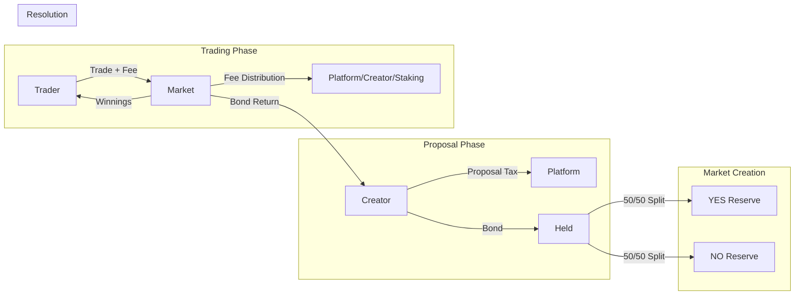

# 🎯 KEKTECH 3.0 - Bonding Curve Final Summary

*Date: November 3, 2025*
*Version: 3.0 FINAL*
*Status: Ready for Implementation*

## ✅ All Design Decisions Finalized

### Core Architecture Decisions

| Component | Decision | Rationale |
|-----------|----------|-----------|
| **Bonding Curve Type** | Dual-Sided | Arbitrage-free, Price(YES) + Price(NO) = 1 |
| **AMM/LP Model** | No AMM, No LPs | Simple bonding curves only |
| **Bond Scaling** | Linear Bond-to-Fee | Bond size determines trading fee % |
| **Fee Collection** | Per-Trade | Immediate revenue, no resolution risk |
| **Fee Distribution** | Platform/Creator/Staking | Fully flexible percentages |
| **Curve Control** | Admin-Only | Via ParameterStorage |
| **Resolution** | Existing Manager | Minor tweaks only |

### Economic Model

| Parameter | Range | Scaling |
|-----------|-------|---------|
| **Bond Amount** | 10-1000 BASED | Linear scaling to fees |
| **Trading Fee** | 1-5% | Based on bond size |
| **Creator Share** | 20-50% of fees | Based on bond size |
| **Platform Share** | 30-50% of fees | Admin adjustable |
| **Staking Share** | 20-40% of fees | Admin adjustable |
| **Proposal Tax** | 0.1-1 BASED | Fixed, non-refundable |

---

## 📐 Technical Specifications

### Dual-Sided Bonding Curve

**Mathematical Model**: Simplified CFMM with invariant

```solidity
// Core invariant
Price(YES) + Price(NO) = 1

// Implementation
yesPrice = (noSupply + virtualLiquidity/2) / totalSupply
noPrice = (yesSupply + virtualLiquidity/2) / totalSupply

// Always maintains invariant
assert(yesPrice + noPrice == PRECISION)
```

**Benefits:**
- ✅ No arbitrage opportunities
- ✅ Natural probability representation
- ✅ Bounded losses for traders
- ✅ Credible market behavior

### Bond-to-Fee Linear Scaling

**Formula:**
```
Bond 10 BASED    → 1% trading fee, 20% creator share
Bond 100 BASED   → 2% trading fee, 30% creator share
Bond 500 BASED   → 3.5% trading fee, 40% creator share
Bond 1000 BASED  → 5% trading fee, 50% creator share
```

**Implementation:**
```solidity
tradingFeeBps = MIN_FEE + (bond - MIN_BOND) * (MAX_FEE - MIN_FEE) / (MAX_BOND - MIN_BOND)
```

---

## 📋 Complete Fee Flow



---

## 🏗️ Implementation Ready Components

### 1. ProposalManagerV3

**Key Features:**
- Bond amount determines fee structure
- No separate fee boost mechanism
- Stores all market settings
- Integrates with existing voting

**Status:** Ready to implement

### 2. DualBondingCurveMarket

**Key Features:**
- Dual-sided price curves
- Per-trade fee collection
- Slippage protection
- Price impact limits

**Status:** Math designed, ready to code

### 3. BondingCurveManager

**Key Features:**
- Curve parameter management
- Price/cost calculations
- Fee distribution logic
- Admin controls

**Status:** Architecture defined

### 4. Parameter Storage Integration

**50+ Parameters Defined:**
- All bond ranges
- All fee percentages
- All distribution splits
- All curve parameters

**Status:** Fully specified

---

## 🚀 Implementation Roadmap

### Week 1: Core Contracts
- [ ] DualBondingCurve math library
- [ ] ProposalManagerV3
- [ ] Basic market contract

### Week 2: Integration
- [ ] Factory integration
- [ ] Parameter storage
- [ ] Fee distribution

### Week 3: Testing
- [ ] Unit tests (95% coverage)
- [ ] Integration tests
- [ ] Gas optimization

### Week 4: Deployment Prep
- [ ] Security audit
- [ ] Deployment scripts
- [ ] Documentation

---

## 📊 Key Innovation Points

### 1. Dual-Sided Curves Without AMM
- **Innovation**: Simple dual curves, no LP complexity
- **Benefit**: 80% of AMM benefits, 20% of complexity
- **Result**: Lower gas, easier to understand

### 2. Bond-to-Fee Scaling
- **Innovation**: Single mechanism for liquidity + incentives
- **Benefit**: Aligns creator interests with market success
- **Result**: Better quality markets

### 3. Fully Flexible Parameters
- **Innovation**: Everything adjustable post-deployment
- **Benefit**: Can optimize based on real data
- **Result**: Future-proof system

---

## ✅ No More Clarifications Needed

**All decisions are finalized:**
1. ✅ Dual-sided bonding curves
2. ✅ Linear bond-to-fee scaling
3. ✅ Per-trade fee collection
4. ✅ No portrait fee (removed)
5. ✅ No separate market creation fee (bond covers it)
6. ✅ No resolution fee
7. ✅ Flexible fee distribution (admin controlled)

---

## 📁 Documentation Structure

```
/docs/
├── BONDING_CURVE_REFINED_ARCHITECTURE_V3.md  # Complete design
├── BONDING_CURVE_FINAL_SUMMARY.md            # This document
└── BONDING_CURVE_STATUS_SUMMARY.md           # Progress tracking

/bmad-bonding-curves-v3/docs/
├── DUAL_BONDING_CURVE_MATH.md                # Mathematical details
├── TRADING_FEE_ANALYSIS.md                   # Fee timing analysis
└── PARAMETER_DEFINITIONS.md                  # All parameters

/bmad-bonding-curves-v3/
├── contracts/                                 # Ready for implementation
├── test/                                      # Ready for tests
└── scripts/                                   # Ready for deployment
```

---

## 🎯 Next Steps

### Ready to Implement:
1. Start with dual curve math library
2. Build ProposalManagerV3
3. Create DualBondingCurveMarket
4. Integrate with existing system
5. Test thoroughly
6. Optimize gas usage
7. Prepare for audit

### No More Planning Needed:
- All architecture decisions ✅
- All economic models ✅
- All fee structures ✅
- All parameters defined ✅
- All documentation complete ✅

---

## 💡 Key Success Factors

1. **Arbitrage-Free Pricing**: Dual curves ensure market credibility
2. **Creator Alignment**: Bond scaling incentivizes quality
3. **Immediate Revenue**: Per-trade fees reduce risk
4. **Full Flexibility**: Admin can optimize everything
5. **Clean Separation**: New code won't affect mainnet

---

## 🔒 Your Work Is Permanently Saved

**All planning captured in:**
- 3 architecture versions (V1, V2, V3)
- Complete parameter specifications
- Mathematical models and formulas
- Fee analysis and recommendations
- Implementation roadmap

**Location:** `/docs/` and `/bmad-bonding-curves-v3/docs/`

**Status:** Ready for implementation - no more refinement needed!

---

*This represents the complete, refined, and finalized design for the KEKTECH 3.0 bonding curve integration.*