# KEKTECH 3.0 - Prediction Market Platform on BasedAI Chain

## 🚨 CRITICAL: DEPLOYMENT IN PROGRESS - NO DEVIATIONS ALLOWED
**WE ARE FOLLOWING THE BULLETPROOF DEPLOYMENT MASTER PLAN**
**DO NOT DEVIATE FROM THE PLAN UNTIL MAINNET DEPLOYMENT IS SUCCESSFUL**

### ⏰ CURRENT DEPLOYMENT STATUS
```
📅 Start Date: November 4, 2025
📍 Current Day: DAY 7 OF 21 - 🔄 IN PROGRESS
🎯 Current Phase: WEEK 1 - SEPOLIA DEPLOYMENT RETRY
✅ Last Completed: Day 6 - Improved strategy with 15x gas + retry logic
⏭️ Current Task: Deploy all 8 contracts with improved script

Status: 🔄 DAY 7 IN PROGRESS - Deploying with improved strategy
Confidence: 95% (85% success probability with improvements)
```

## Project Overview
Building a modular, upgradeable prediction market ecosystem on BasedAI Chain (ID: 32323) with flexible economic parameters, registry-based architecture, and progressive decentralization (V0→V3).

## 📋 CRITICAL PLANNING DOCUMENTS (ALWAYS CHECK THESE)

### 🚀 MANDATORY DEPLOYMENT DOCUMENTS - FOLLOW EXACTLY!
**⚠️ NO DEVIATIONS - NO EXCEPTIONS - NO SHORTCUTS**

1. **FINAL_BULLETPROOF_DEPLOYMENT_MASTER_PLAN.md** ⭐⭐⭐ **[PRIMARY REFERENCE]**
   - **THIS IS THE LAW** - Follow every step exactly
   - 21-day dual-testing strategy (Fork + Sepolia)
   - Complete automation with security auditing
   - Small team optimized (1-2 people)
   - Private beta before public launch
   - **CHECK THIS DOCUMENT BEFORE EVERY ACTION**

2. **DUAL_TESTING_VALIDATION_CHECKLIST.md** ⭐⭐ **[MUST COMPLETE 100%]**
   - **CANNOT PROCEED WITHOUT VALIDATION**
   - Parallel validation framework
   - Cross-environment comparison
   - Must-pass criteria for both Fork and Sepolia
   - **Every checkbox must be checked before phase progression**

3. **QUICK_START_DUAL_TESTING.md** ⭐ **[DAILY GUIDE]**
   - **TODAY'S TASKS ARE HERE**
   - Day-by-day implementation
   - Essential scripts and commands
   - Troubleshooting guide
   - **Start each day by checking this document**

### Implementation Documents
- **LMSR Master Plan**: `/LMSR_MASTER_PLAN.md` ⭐ PRIMARY IMPLEMENTATION GUIDE
- **Cleanup Checklist**: `/CLEANUP_CHECKLIST.md` - Validation checklist for compliance
- **Original Spec**: `/BONDING_CURVE_PLANNING_COMPLETE.md` - Correct LMSR requirements
- **Blueprint**: `/KEKTECH_3.0_Refined_Blueprint_v1.md` - System architecture
- **Roadmap**: `/KEKTECH_3.0_Implementation_Roadmap_v1.1.md` - Implementation timeline

## Core Architecture
```
Master Registry Pattern (No Proxies)
├── ParameterStorage (All configurable values)
├── AccessControlManager (Roles & permissions)
├── FlexibleMarketFactory (Market creation)
├── ProposalManager (Community proposals)
├── ResolutionManager (Market outcomes)
├── RewardDistributor (Fee splitting)
└── PredictionMarket (Binary betting logic)
```

## Development Environment
- **Blockchain**: BasedAI (Chain ID: 32323 mainnet, 32324 testnet)
- **Token**: $BASED native token
- **Frameworks**: Hardhat + Foundry (dual testing)
- **Languages**: Solidity 0.8.19+
- **Testing**: 95% coverage requirement with TDD

## 🔬 DUAL-TESTING STRATEGY (Fork + Sepolia = 100% Coverage)
```
MAXIMUM COVERAGE APPROACH:
1. Fork Testing → Mainnet state simulation, time manipulation, whale testing ($0)
2. Sepolia Testing → Real network conditions, gas dynamics, public validation (~$0.01/test)
3. Parallel Testing → Run identical scenarios on both environments
4. Cross-Validation → Compare results, resolve discrepancies
5. Mainnet → Deploy only after both environments validate

Why This Is Bulletproof:
- Fork catches: Logic bugs, state issues, time-dependent bugs
- Sepolia catches: Network issues, gas problems, latency
- Together: 100% confidence before mainnet
```

## 🛑 VALIDATION GATES - MUST PASS BEFORE PROCEEDING

### STOP CONDITIONS (If any are true, STOP IMMEDIATELY)
```
❌ Security audit shows Critical/High issues → STOP, fix before proceeding
❌ Fork tests failing → STOP, debug and fix
❌ Sepolia tests failing → STOP, investigate network issues
❌ Gas costs >2x estimate → STOP, optimize before continuing
❌ Cross-validation mismatch >10% → STOP, resolve discrepancies
❌ Private beta has critical issues → STOP, do not go public
```

### PHASE PROGRESSION REQUIREMENTS
```
Week 1 → Week 2: ✅ All audits clean, ✅ Fork deployed, ✅ Sepolia deployed
Week 2 → Week 3: ✅ Parallel tests pass, ✅ All attacks blocked, ✅ Load tests pass
Beta → Public: ✅ 48 hours stable, ✅ No critical issues, ✅ Positive feedback
```

## Key Commands
```bash
# Development
cd expansion-packs/bmad-blockchain-dev
npm run node:fork        # Start BasedAI mainnet fork
npm run deploy:fork      # Deploy to fork for testing
npm test                 # Run Hardhat tests
forge test --fuzz        # Run Foundry fuzz tests

# Multi-Network Deployment
npm run deploy:local     # Local development
npm run deploy:sepolia   # Cheap public testing
npm run deploy:testnet   # BasedAI testnet
npm run deploy:mainnet   # Production (requires multisig)

# Security & Optimization
npm run test:gas         # Gas usage report
npm run security:slither # Static analysis
forge test --invariant   # Invariant testing
```

## BMad Blockchain Agent Commands
```bash
/bmad-bc/architect       # System design & architecture
/bmad-bc/solidity       # Smart contract development
/bmad-bc/security       # Security audit & analysis
/bmad-bc/gas            # Gas optimization
/bmad-bc/deploy         # Deployment orchestration
/bmad-bc/economic       # Token economics modeling
/bmad-bc/governance     # DAO & governance setup
```

## Project Rules
1. **TDD Mandatory**: Tests MUST be written before implementation
2. **Gas Targets**: setContract <50k, placeBet <100k, createMarket <200k
3. **Security First**: All functions need access control, reentrancy guards
4. **Multi-Network Testing**: Test on fork before any real network
5. **Documentation**: Every contract, function, and decision documented
6. **Registry Pattern**: All upgrades through Master Registry only
7. **Event-Driven**: Emit events for all state changes
8. **Fork Testing First**: Always test on fork before testnet/mainnet

## 📅 21-DAY DEPLOYMENT WORKFLOW (NO DEVIATIONS!)

```mermaid
graph LR
    A[Day 1-2: Security Audit] --> B[Day 3-4: Fork Deploy]
    B --> C[Day 5-6: Sepolia Deploy]
    C --> D[Day 7: Week 1 Validation]
    D --> E[Day 8-9: Parallel Testing]
    E --> F[Day 10-13: Advanced Testing]
    F --> G[Day 14: Issue Resolution]
    G --> H[Day 15-16: Final Simulation]
    H --> I[Day 17-18: Private Beta]
    I --> J[Day 19-20: Gradual Rollout]
    J --> K[Day 21: Full Production]
```


### Daily Checkpoint Requirements
```
Every Day:
1. Check QUICK_START_DUAL_TESTING.md for today's tasks
2. Complete tasks in order (no skipping)
3. Update DUAL_TESTING_VALIDATION_CHECKLIST.md
4. Document results
5. Commit progress
```

## 📊 DEPLOYMENT PROGRESS TRACKER

### Pre-Deployment Status
- ✅ Multi-network configuration complete
- ✅ Master Registry implemented
- ✅ Fork testing setup ready
- ✅ Directory structure optimized
- ✅ LMSR bonding curves implemented
- ✅ 218 tests passing
- ✅ Deployment plan created

### 🎯 DEPLOYMENT TODO LIST
**CRITICAL**: Check `/DEPLOYMENT_TODO_CHECKLIST.md` for complete task tracking
```
Current Phase: WEEK 1 - DAY 7 - SEPOLIA RETRY
Next Action: Run improved deployment script (npm run deploy:sepolia:improved)
Progress: 6/21 Days Complete | Day 7 Next (November 5, 2025)
Achievement: Improved strategy with 15x gas + retry logic! 🚀
```

### Deployment Phases Status
```
📅 Week 1: Foundation & Testing      [🔄 IN PROGRESS - DAY 1✅ DAY 2✅ DAY 3✅ DAY 4✅ DAY 5✅ DAY 6✅ DAY 7 NEXT]
📅 Week 2: Advanced Validation        [⏸️ NOT STARTED]
📅 Week 3: Production Deployment      [⏸️ NOT STARTED]
🎯 Mainnet: Live & Operational       [⏸️ NOT STARTED]

Progress: [■■■■■■□□□□□□□□□□□□□□□] 28.6% Complete (6/21 days)
```

## 🎯 BONDING CURVE IMPLEMENTATION
**CRITICAL**: We are implementing LMSR (Logarithmic Market Scoring Rule) bonding curves, NOT AMM.
- **Master Plan**: `/LMSR_MASTER_PLAN.md` - Complete implementation guide
- **Cleanup First**: `/CLEANUP_CHECKLIST.md` - Remove wrong AMM files
- **Original Spec**: `/BONDING_CURVE_PLANNING_COMPLETE.md` - Correct requirements

### LMSR Implementation Timeline
- Days 1-3: Core LMSR math and market contract
- Days 4-6: Template system for multiple curves
- Days 7-8: KEKTECH integration
- Days 9-10: Testing and documentation
- Week 3: Deployment pipeline

## Important Files
- **LMSR Implementation**: `/LMSR_MASTER_PLAN.md` ⭐ PRIMARY REFERENCE
- **Cleanup Guide**: `/CLEANUP_CHECKLIST.md`
- Blueprint: `/KEKTECH_3.0_Refined_Blueprint_v1.md`
- Roadmap: `/KEKTECH_3.0_Implementation_Roadmap_v1.1.md`
- Contracts: `/expansion-packs/bmad-blockchain-dev/contracts/`
- Tests: `/expansion-packs/bmad-blockchain-dev/test/`
- Deployment: `/expansion-packs/bmad-blockchain-dev/scripts/deploy/`

## CodeRabbit Integration
- Always run CodeRabbit review before commits and PRs
- Auto-fix issues with confidence >0.8
- Use background execution for non-blocking workflow (7-30+ min reviews)
- Validate fixes with re-review and testing
- Integration with /implement, /build, /improve, /git commands

## Server Management
- Development happens locally, not on VPS for smart contracts
- Use fork testing for mainnet simulation
- Deploy progressively through networks
- Transfer to safe wallet after deployment (not multi-sig)

## 🚨 EMERGENCY PROCEDURES
**If anything goes wrong, check these immediately:**
1. **STOP DEPLOYMENT** if any validation gate fails
2. Check `/FINAL_BULLETPROOF_DEPLOYMENT_MASTER_PLAN.md` Section: Emergency Procedures
3. Document the issue in `/DEPLOYMENT_TODO_CHECKLIST.md`
4. Fix the issue completely before proceeding
5. Re-run ALL tests for that phase
6. Only proceed when 100% validated

## ⚠️ FINAL REMINDERS
```
🔴 DO NOT SKIP ANY STEP IN THE DEPLOYMENT PLAN
🔴 DO NOT PROCEED WITHOUT VALIDATION
🔴 DO NOT DEPLOY WHEN TIRED
🔴 DO NOT RUSH THE PROCESS
🟢 FOLLOW THE PLAN EXACTLY
🟢 DOCUMENT EVERYTHING
🟢 TEST TWICE, DEPLOY ONCE
```