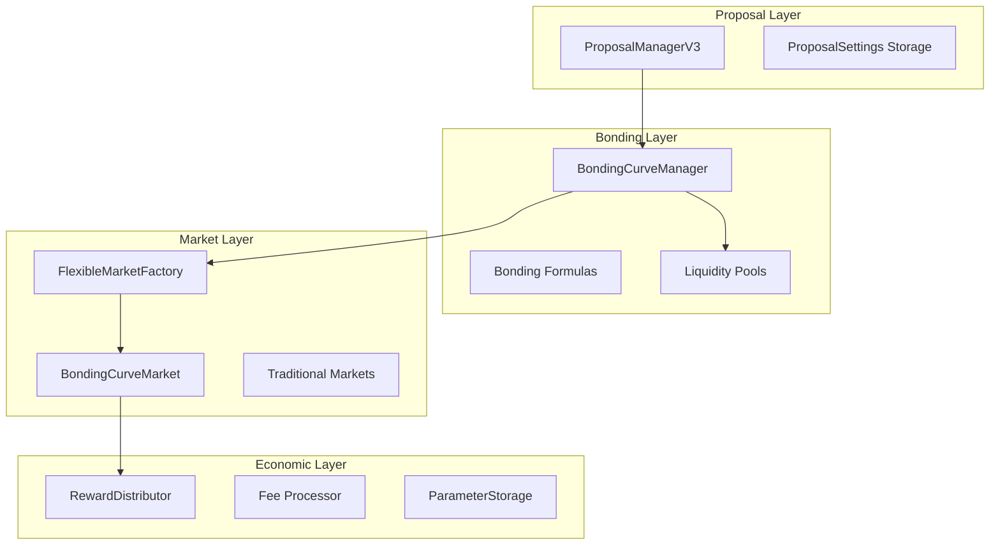

# 🎯 KEKTECH 3.0 - Bonding Curve Refined Architecture v1.0

*Last Updated: November 3, 2025*

## Executive Summary

A refined prediction market architecture integrating **bonding curves** with the existing proposal system, enabling dynamic liquidity provision, flexible fee structures, and sustainable economics. This design maintains compatibility with deployed mainnet contracts while introducing powerful new capabilities.

---

## 🏗️ Core Architecture Overview

### System Components



---

## 📋 Proposal System Enhancement

### Current State Analysis

**ProposalManagerV2 (Deployed)**:
- Fixed bond amount: 100 BASED
- Fixed creation fee: % of bond
- Fixed proposal tax: Set amount
- States: Pending → Active → Approved/Rejected/Expired → MarketCreated/BondRefunded

### Refined Proposal System

**New ProposalManagerV3 Features**:

```solidity
struct EnhancedProposal {
    // === Core Fields (existing) ===
    uint256 id;
    address creator;
    string marketQuestion;
    bytes32 category;
    ProposalState state;

    // === Market Settings (NEW) ===
    MarketSettings settings;      // All user-defined parameters

    // === Economic Fields (NEW) ===
    uint256 initialLiquidity;     // Bond becomes initial liquidity
    uint256 creatorFeeBoost;      // Additional fee for higher trading income
    uint256 proposalTax;          // Platform tax (non-refundable)

    // === Bonding Curve Config (NEW) ===
    CurveType curveType;          // LINEAR, SIGMOID, QUADRATIC
    uint256[] curveParams;        // Dynamic parameters for curve

    // === Voting ===
    uint256 forVotes;
    uint256 againstVotes;
    uint256 votingEnd;
}

struct MarketSettings {
    string outcome1;
    string outcome2;
    uint256 resolutionTime;
    uint256 tradingFeePercent;    // Base trading fee
    uint256 minBetAmount;         // Minimum bet size
    uint256 maxBetAmount;         // Maximum bet size
    bool allowEarlyResolution;    // Can resolve before deadline
    address resolver;              // Custom resolver (optional)
    bytes32 dataSource;           // Oracle data source (optional)
}
```

### Proposal Flow

```
1. CREATE PROPOSAL
   ├── User submits all market settings
   ├── Pays: Bond + Creator Fee Boost + Proposal Tax
   ├── Bond → Will become initial liquidity
   ├── Creator Fee Boost → Increases trading fee share
   └── Proposal Tax → Platform treasury (non-refundable)

2. COMMUNITY VOTING
   ├── Off-chain voting via snapshot
   ├── Admin submits results on-chain
   └── Threshold check for approval

3. PROPOSAL OUTCOMES
   ├── APPROVED
   │   ├── Market created with exact settings
   │   ├── Bond → Initial bonding curve liquidity
   │   └── Creator gets enhanced fee share
   ├── REJECTED
   │   ├── Bond refunded to creator
   │   ├── Creator fee boost refunded
   │   └── Proposal tax kept by platform
   └── EXPIRED
       ├── Bond refunded to creator
       ├── Creator fee boost refunded
       └── Proposal tax kept by platform
```

---

## 💰 Bonding Curve Integration

### Bonding Curve Manager

```solidity
contract BondingCurveManager {
    // Curve types
    enum CurveType { LINEAR, SIGMOID, QUADRATIC, CUSTOM }

    // Curve registry
    mapping(CurveType => address) public curveImplementations;

    // Calculate buy price
    function calculateBuyPrice(
        address market,
        uint8 outcome,
        uint256 amount
    ) external view returns (uint256 cost);

    // Calculate sell price
    function calculateSellPrice(
        address market,
        uint8 outcome,
        uint256 amount
    ) external view returns (uint256 proceeds);

    // Initialize market liquidity
    function initializeLiquidity(
        address market,
        uint256 initialBond
    ) external;
}
```

### Bonding Curve Formulas

**1. Linear Curve**
```
Price = a * Supply + b
Cost = ∫(a * s + b)ds = (a/2) * s² + b * s
```

**2. Sigmoid Curve**
```
Price = 1 / (1 + e^(-k*(supplyYes - supplyNo)))
Provides natural bounds [0,1] for probability
```

**3. Quadratic Curve**
```
Price = a * Supply² + b * Supply + c
Higher price sensitivity as supply grows
```

---

## 🏪 Market Creation with Bonding Curves

### Enhanced Market Factory

```solidity
function createMarketFromApprovedProposal(
    uint256 proposalId
) external returns (address market) {
    // Get approved proposal
    EnhancedProposal memory proposal = getProposal(proposalId);
    require(proposal.state == ProposalState.Approved);

    // Clone bonding curve market template
    market = cloneBondingCurveMarket();

    // Initialize with proposal settings
    IBondingCurveMarket(market).initialize(
        proposal.settings,           // All market parameters
        proposal.curveType,          // Curve selection
        proposal.curveParams,        // Curve configuration
        proposal.initialLiquidity,   // Bond as initial liquidity
        proposal.creatorFeeBoost    // Enhanced fee percentage
    );

    // Transfer initial liquidity (the bond)
    transferBondToMarket(market, proposal.initialLiquidity);

    // Update proposal state
    proposal.state = ProposalState.MarketCreated;
    proposal.marketAddress = market;
}
```

---

## 📊 Economic Model

### Fee Structure

```
TRADING FEE BREAKDOWN:
├── Base Trading Fee: 2.5% (250 BPS)
│   ├── Platform: 1% (100 BPS)
│   ├── Market Creator: 0.5% (50 BPS)
│   ├── Liquidity Providers: 0.5% (50 BPS)
│   └── Resolver: 0.5% (50 BPS)
│
└── With Creator Fee Boost: +X%
    └── Extra goes to creator

PROPOSAL FEES:
├── Proposal Tax: 0.1 BASED (non-refundable)
├── Initial Bond: 10-1000 BASED (becomes liquidity)
└── Creator Boost: 0-100 BASED (increases fee share)
```

### Dynamic Parameters

All parameters stored in ParameterStorage:

```solidity
// Proposal Parameters
MIN_INITIAL_BOND = 10 BASED
MAX_INITIAL_BOND = 1000 BASED
PROPOSAL_TAX = 0.1 BASED
MAX_CREATOR_BOOST = 100 BASED
CREATOR_BOOST_MULTIPLIER = 10 // 10x boost = +1% fee

// Trading Parameters
BASE_TRADING_FEE = 250 // 2.5%
MIN_BET_AMOUNT = 0.01 BASED
MAX_BET_PERCENTAGE = 2000 // 20% of pool

// Curve Parameters
DEFAULT_LINEAR_SLOPE = 100 // a parameter
DEFAULT_SIGMOID_K = 5 // steepness
DEFAULT_QUADRATIC_A = 10 // acceleration
```

---

## 🔧 Technical Implementation

### Directory Structure

```
kektechbmad100/
├── expansion-packs/
│   ├── bmad-blockchain-dev/        # DEPLOYED (DO NOT MODIFY)
│   │   └── deployments/
│   │       └── basedai-mainnet-*.json
│   │
│   └── bmad-bonding-curves-v3/     # NEW DEVELOPMENT
│       ├── contracts/
│       │   ├── core/
│       │   │   ├── ProposalManagerV3.sol
│       │   │   ├── BondingCurveManager.sol
│       │   │   └── EnhancedMarketFactory.sol
│       │   ├── markets/
│       │   │   └── BondingCurveMarket.sol
│       │   ├── curves/
│       │   │   ├── LinearCurve.sol
│       │   │   ├── SigmoidCurve.sol
│       │   │   └── QuadraticCurve.sol
│       │   └── interfaces/
│       │       └── IBondingCurve.sol
│       ├── test/
│       ├── scripts/
│       └── docs/
```

### Integration Points

**With Existing Contracts**:
- MasterRegistry: Register new contracts
- ParameterStorage: Store all dynamic values
- AccessControlManager: Permission control
- ResolutionManager: Market resolution
- RewardDistributor: Fee distribution

---

## ❓ Clarification Questions

Before proceeding with implementation, please clarify:

### 1. Bonding Curve Liquidity

**Question**: How should the initial bond liquidity be distributed?

**Option A**: Split 50/50 between YES and NO
```
10 BASED bond → 5 BASED in YES pool, 5 BASED in NO pool
Initial price = 0.5 for both outcomes
```

**Option B**: Market creator chooses initial distribution
```
10 BASED bond → Creator sets 70% YES, 30% NO
Initial price reflects creator's belief
```

**Option C**: All goes to virtual AMM pool
```
10 BASED bond → Shared liquidity pool
Price determined by first trades
```

### 2. Creator Fee Boost Mechanics

**Question**: How should the fee boost work?

**Option A**: Linear scaling
```
1 BASED boost = +0.1% creator fee
10 BASED boost = +1% creator fee
100 BASED boost = +10% creator fee (max)
```

**Option B**: Tiered system
```
1-10 BASED = +0.5% fee
10-50 BASED = +1% fee
50-100 BASED = +2% fee
```

**Option C**: Auction-based
```
Multiple creators can boost same market
Highest boost gets largest fee share
```

### 3. Proposal Tax Distribution

**Question**: Where should proposal taxes go?

**Option A**: 100% to team/platform treasury
**Option B**: Split between team (50%) and voter rewards (50%)
**Option C**: Split between team (33%), voters (33%), existing market LPs (34%)

### 4. Bond Refund Timing

**Question**: When can bonds be refunded?

**Option A**: Only after market resolution (current)
**Option B**: After voting period if rejected/expired (immediate)
**Option C**: Anytime with penalty (e.g., 10% penalty for early withdrawal)

### 5. Curve Parameter Control

**Question**: Who controls curve parameters?

**Option A**: Fixed at proposal time (immutable)
**Option B**: DAO can adjust via governance
**Option C**: Market creator can adjust within bounds
**Option D**: Algorithm adjusts based on volume/volatility

### 6. Market Resolution Integration

**Question**: How do bonding curve markets resolve?

**Option A**: Same as current markets (ResolutionManager)
**Option B**: Automatic based on oracle data
**Option C**: Hybrid - creator chooses resolution method

### 7. Failed Market Handling

**Question**: What happens to liquidity in failed/disputed markets?

**Option A**: Return all funds proportionally
**Option B**: Platform keeps as insurance fund
**Option C**: Redistribute to other active markets

---

## 🚀 Implementation Phases

### Phase 1: Foundation (Week 1)
- [ ] Set up bmad-bonding-curves-v3 workspace
- [ ] Create ProposalManagerV3 with enhanced fields
- [ ] Implement basic bonding curve math library
- [ ] Write comprehensive tests

### Phase 2: Bonding Curves (Week 2)
- [ ] Implement Linear, Sigmoid, Quadratic curves
- [ ] Create BondingCurveManager
- [ ] Build BondingCurveMarket contract
- [ ] Integration testing with curves

### Phase 3: Integration (Week 3)
- [ ] Connect ProposalV3 → Factory → Markets
- [ ] Parameter storage integration
- [ ] Fee distribution mechanics
- [ ] End-to-end testing

### Phase 4: Optimization (Week 4)
- [ ] Gas optimization
- [ ] Security audit preparation
- [ ] Documentation completion
- [ ] Deployment scripts

---

## 🔐 Security Considerations

1. **Reentrancy Protection**: All external calls protected
2. **Integer Overflow**: Using Solidity 0.8.20+ built-in checks
3. **Access Control**: Role-based permissions via ACM
4. **Slippage Protection**: Min/max amounts for trades
5. **Griefing Protection**: Gas limits on transfers
6. **Front-running Mitigation**: Commit-reveal for sensitive operations
7. **Oracle Security**: Multiple data sources with dispute period

---

## 📈 Success Metrics

- Gas cost per market creation: <200k (with cloning)
- Trading gas cost: <100k per trade
- Initial liquidity utilization: >80% within first week
- Creator fee boost adoption: >30% of proposals
- Market variety: 5+ different curve types in use

---

## 🔄 Migration Strategy

Since contracts are already deployed on mainnet:

1. **New Template Registration**: Add BondingCurveMarket to registry
2. **Parallel Operation**: Both systems work simultaneously
3. **Gradual Adoption**: Users choose bonding or traditional
4. **Data Migration**: None required - new markets only
5. **Backward Compatibility**: Full compatibility maintained

---

## Next Steps

1. Answer clarification questions above
2. Finalize economic parameters
3. Begin Phase 1 implementation
4. Create detailed technical specifications
5. Set up testing environment

---

*This document is version controlled and will be updated as the design evolves.*