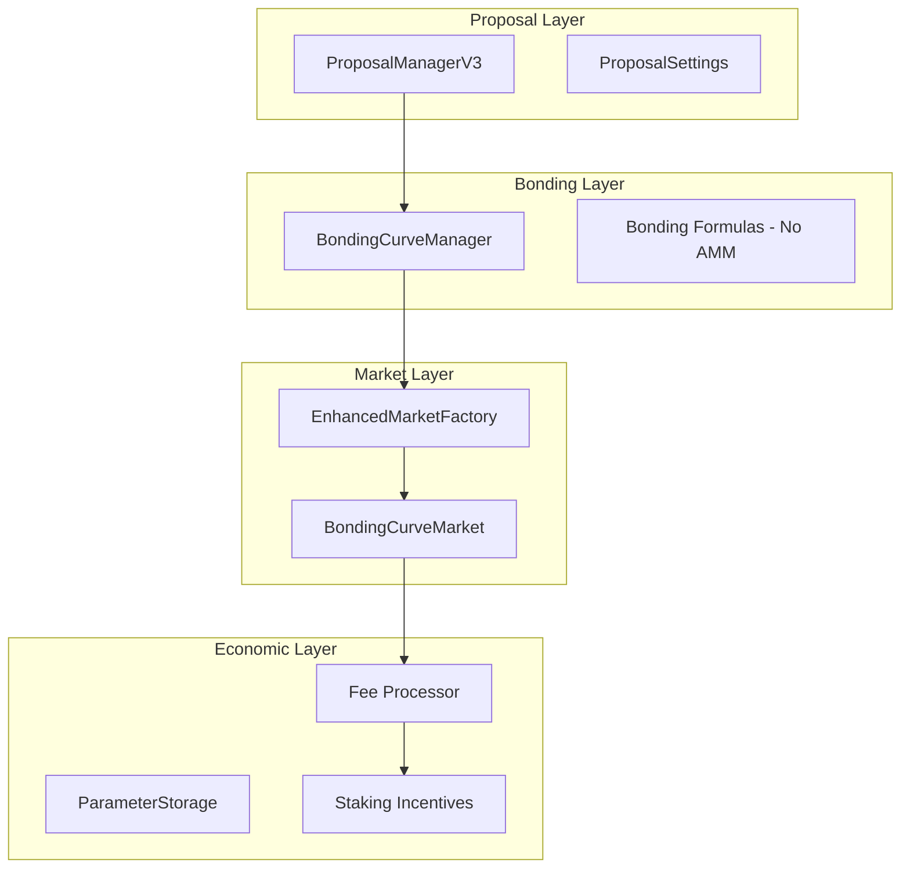

# 🎯 KEKTECH 3.0 - Bonding Curve Refined Architecture v2.0

*Last Updated: November 3, 2025*
*Status: Refined with user clarifications*

## Executive Summary

A refined prediction market architecture integrating **simple bonding curves** (no AMM/LPs) with the proposal system, enabling dynamic liquidity provision through bonds, flexible fee structures, and sustainable economics. This design maintains compatibility with deployed mainnet contracts while introducing powerful new capabilities.

---

## 🏗️ Core Architecture Overview

### Key Design Decisions ✅

1. **Initial Liquidity**: 50/50 split between YES/NO pools
2. **Creator Fee Boost**: Linear scaling with configurable ranges
3. **Proposal Tax**: 100% to platform treasury
4. **Bond Refunds**: After resolution (approved) or immediately (rejected/expired)
5. **Curve Control**: Admin-only via ParameterStorage
6. **Resolution**: Existing ResolutionManager with minor tweaks
7. **No LPs**: Simple bonding curves without AMM complexity
8. **Flexible Fees**: All percentages adjustable via parameters

### System Components



---

## 📋 Enhanced Proposal System

### ProposalManagerV3 Structure

```solidity
struct EnhancedProposal {
    // === Core Fields ===
    uint256 id;
    address creator;
    string marketQuestion;
    bytes32 category;
    ProposalState state;

    // === Market Settings (User Defined) ===
    string outcome1;
    string outcome2;
    uint256 resolutionTime;
    uint256 baseTradingFeePercent;    // User suggests fee (within bounds)
    uint256 minBetAmount;
    uint256 maxBetAmount;
    bool allowEarlyResolution;
    address customResolver;           // Optional

    // === Economic Fields ===
    uint256 initialBond;              // Becomes 50/50 liquidity
    uint256 creatorFeeBoost;          // Linear boost to creator's share
    uint256 proposalTax;              // Platform fee (non-refundable)

    // === Bonding Curve Config ===
    CurveType curveType;              // Selected by platform, not user
    // Curve params controlled by admin only

    // === Voting ===
    uint256 forVotes;
    uint256 againstVotes;
    uint256 votingEnd;

    // === Market Reference ===
    address marketAddress;
}
```

### Complete Fee Structure

```solidity
struct FeeStructure {
    // === PROPOSAL PHASE FEES ===
    uint256 proposalTax;           // Fixed platform fee (e.g., 0.1 BASED)
    uint256 initialBond;           // Variable (10-1000 BASED) → liquidity
    uint256 creatorFeeBoost;       // Optional (0-100 BASED) → higher share

    // === MARKET CREATION FEES ===
    uint256 marketCreationFee;     // Platform fee for launching market
    uint256 portraitFee;           // Fee for custom market imagery/branding

    // === TRADING PHASE FEES ===
    uint256 baseTradingFee;        // Per-trade or at resolution (TBD)
    // Distribution:
    // - Platform: X%
    // - Creator: Y% (+ boost)
    // - Staking: Z%

    // === RESOLUTION PHASE FEES ===
    uint256 resolutionFee;         // Fee for resolver service
    uint256 claimFee;              // Fee for claiming winnings
}
```

---

## 💰 Bonding Curve Implementation (Simple, No AMM)

### Core Concept

**NO Liquidity Providers** - Just simple price curves based on supply/demand:

```solidity
contract SimpleBondingCurve {
    // State (minimal - no LP tokens, no complex AMM state)
    uint256 public yesSupply;
    uint256 public noSupply;
    uint256 public yesReserve;  // ETH backing YES
    uint256 public noReserve;   // ETH backing NO

    // No LP mechanics - just buy/sell against curve
    function buyYes(uint256 minShares) external payable {
        uint256 shares = calculateSharesFromETH(msg.value, yesSupply);
        yesSupply += shares;
        yesReserve += msg.value;
        // Transfer shares to buyer
    }

    function sellYes(uint256 shares, uint256 minETH) external {
        uint256 eth = calculateETHFromShares(shares, yesSupply);
        yesSupply -= shares;
        yesReserve -= eth;
        // Send ETH to seller
    }
}
```

### Bonding Curve Formulas (Admin Controlled)

All curve parameters stored in ParameterStorage and adjustable by admin:

```solidity
// Linear Curve
CURVE_LINEAR_SLOPE = 100      // Admin adjustable
CURVE_LINEAR_INTERCEPT = 50   // Admin adjustable

// Sigmoid Curve
CURVE_SIGMOID_K = 5           // Steepness - admin adjustable
CURVE_SIGMOID_MIDPOINT = 500  // Inflection point - admin adjustable

// Quadratic Curve
CURVE_QUADRATIC_A = 10        // Acceleration - admin adjustable
CURVE_QUADRATIC_B = 100       // Linear component - admin adjustable
```

---

## 🎯 Clarified Design Points

### 1. Initial Liquidity Distribution ✅

**Answer: 50/50 Split + Optional Creator Bet**

```solidity
function initializeMarketLiquidity(address market, uint256 bond) internal {
    // Split bond 50/50
    uint256 halfBond = bond / 2;

    // Initialize both sides equally
    BondingCurveMarket(market).initializeLiquidity(
        halfBond,  // YES reserve
        halfBond   // NO reserve
    );

    // Creator can still place additional bet separately
    // This is a normal bet, not part of initial liquidity
}
```

### 2. Creator Fee Boost ✅

**Answer: Linear Scaling with Configurable Ranges**

```solidity
// Parameters in ParameterStorage
MIN_CREATOR_BOOST = 0 BASED
MAX_CREATOR_BOOST = 100 BASED
BOOST_TO_FEE_MULTIPLIER = 10  // 10 BASED boost = 1% extra fee

// Example calculation
uint256 extraFeePercent = (creatorBoost * BOOST_TO_FEE_MULTIPLIER) / 1000;
// 10 BASED boost → 0.1% extra
// 100 BASED boost → 1% extra
```

### 3. Fee Distribution ✅

**Answer: Platform, Creator, Staking (No LPs)**

```solidity
struct FeeDistribution {
    uint256 platformPercent;      // e.g., 40% (4000 BPS)
    uint256 creatorPercent;        // e.g., 30% (3000 BPS) + boost
    uint256 stakingPercent;        // e.g., 30% (3000 BPS)
    // Total: 100% (10000 BPS)
}

// NO LP FEES since we don't have liquidity providers!
```

### 4. Trading Fee Timing 🤔

**Two Options to Consider:**

**Option A: Per-Trade Collection** ✅ Recommended
```solidity
function buyShares() external payable {
    uint256 fee = (msg.value * tradingFeePercent) / 10000;
    uint256 amountAfterFee = msg.value - fee;

    // Immediately distribute fee
    distributeFee(fee);

    // Rest goes to bonding curve
    // ...
}

PROS:
- Immediate revenue
- No resolution risk
- Continuous cash flow
- Simpler accounting

CONS:
- Higher gas per trade
- More complex trades
```

**Option B: At Resolution Collection**
```solidity
function resolveMarket() external {
    uint256 totalPool = yesReserve + noReserve;
    uint256 fees = (totalPool * tradingFeePercent) / 10000;
    uint256 payoutPool = totalPool - fees;

    // Distribute fees
    distributeFee(fees);

    // Pay winners from remaining pool
    // ...
}

PROS:
- Lower gas during trading
- Simpler trades
- Larger fee pool

CONS:
- Delayed revenue
- Risk if market fails
- Complex calculations
```

### 5. Complete Fee Timeline

```
PROPOSAL PHASE
├── Proposal Tax → Platform (immediate, non-refundable)
├── Initial Bond → Held (becomes liquidity)
├── Creator Boost → Held (locks in higher fee share)
└── Portrait Fee → Platform (for custom branding)

MARKET CREATION
├── Market Creation Fee → Platform (one-time)
└── Initial Bond → 50/50 into YES/NO reserves

TRADING PHASE
├── Trading Fees (Option A or B above)
│   ├── Platform Share (X%)
│   ├── Creator Share (Y% + boost)
│   └── Staking Share (Z%)
└── [Continuous until resolution]

RESOLUTION PHASE
├── Resolution Fee → Resolver (from pool)
├── Claim Fee → Platform (per claim)
└── Bond Refund → Creator (if not disputed)
```

### 6. Failed/Disputed Markets Clarification ✅

**What I meant by "failed markets":**
- Markets that get disputed after resolution
- Markets with invalid outcomes
- Markets with oracle failures
- Markets cancelled by admin

**Answer: Return Proportionally**
```solidity
function handleDisputedMarket(address market) external onlyAdmin {
    // Calculate each user's proportion
    // Return funds proportionally
    // Refund creator bond
    // Keep only proposal tax (already collected)
}
```

---

## 📊 Flexible Parameter Ranges

All these stored in ParameterStorage, adjustable by admin:

```solidity
// === PROPOSAL PARAMETERS ===
MIN_INITIAL_BOND: 10 BASED
MAX_INITIAL_BOND: 1000 BASED
PROPOSAL_TAX: 0.1 BASED (fixed)
MIN_CREATOR_BOOST: 0 BASED
MAX_CREATOR_BOOST: 100 BASED
BOOST_MULTIPLIER: 10 (10 BASED = 1% extra fee)

// === TRADING PARAMETERS ===
MIN_TRADING_FEE: 10 (0.1%)
MAX_TRADING_FEE: 1000 (10%)
DEFAULT_TRADING_FEE: 250 (2.5%)
MIN_BET_AMOUNT: 0.01 BASED
MAX_BET_PERCENTAGE: 2000 (20% of pool)

// === FEE DISTRIBUTION ===
PLATFORM_FEE_SHARE: 4000 (40%)
CREATOR_FEE_SHARE: 3000 (30%)
STAKING_FEE_SHARE: 3000 (30%)

// === CURVE PARAMETERS ===
CURVE_TYPE: LINEAR/SIGMOID/QUADRATIC
CURVE_PARAM_1: [curve specific]
CURVE_PARAM_2: [curve specific]

// === RESOLUTION PARAMETERS ===
RESOLUTION_FEE: 10 (0.1% of pool)
CLAIM_FEE: 5 (0.05% of winnings)
DISPUTE_PERIOD: 86400 (24 hours)
```

---

## ❓ Remaining Decisions Needed

### 1. Trading Fee Collection Timing

**Which approach do you prefer?**

**A) Per-Trade Collection** (Recommended)
- Immediate revenue
- Higher gas (~20k extra per trade)
- No resolution risk

**B) At Resolution Collection**
- Lower trading gas
- Bulk collection at end
- Risk if market disputed

### 2. Portrait Fee Amount & Timing

**When and how much for custom market imagery?**
- Amount: Fixed (e.g., 1 BASED) or percentage?
- Timing: At proposal or at market creation?
- Optional or required?

### 3. Market Creation Fee

**Should there be an additional fee when proposal becomes market?**
- Who pays: Original creator or market deployer?
- Amount: Fixed or percentage of bond?
- Purpose: Spam prevention or revenue?

### 4. Fee Distribution Percentages

**Current proposal (adjustable):**
- Platform: 40%
- Creator: 30% (+ boost)
- Staking: 30%

**Is this the right balance?**

### 5. Resolution Fee Model

**How should resolver be compensated?**
- Fixed fee from platform?
- Percentage of pool?
- Paid by winners only?

---

## 🚀 Implementation Priority

Based on clarifications, here's the updated roadmap:

### Phase 1: Core Contracts (Week 1)
- [x] Documentation and architecture
- [ ] ProposalManagerV3 with all fee types
- [ ] SimpleBondingCurve (no AMM/LP complexity)
- [ ] Parameter definitions

### Phase 2: Fee System (Week 2)
- [ ] Fee collection mechanism (per-trade vs resolution)
- [ ] Distribution contracts
- [ ] Staking integration points
- [ ] Portrait fee system

### Phase 3: Integration (Week 3)
- [ ] Factory integration
- [ ] Resolution manager tweaks
- [ ] Testing suite
- [ ] Gas optimization

### Phase 4: Admin Tools (Week 4)
- [ ] Curve parameter adjustment UI
- [ ] Fee distribution monitoring
- [ ] Market analytics
- [ ] Emergency functions

---

## 🔄 Next Steps

1. **Decide on trading fee timing** (per-trade vs resolution)
2. **Confirm fee percentages** for distribution
3. **Define portrait and market creation fees**
4. **Begin Phase 1 implementation**

---

## 📝 Change Log

### v2.0 (Current)
- Clarified all 7 design questions
- Removed LP/AMM complexity
- Added complete fee structure
- Defined admin-controlled curves
- Added staking to fee distribution

### v1.0
- Initial architecture design
- Basic bonding curve concept
- Initial questions posed

---

*This document is actively maintained and will evolve with implementation.*