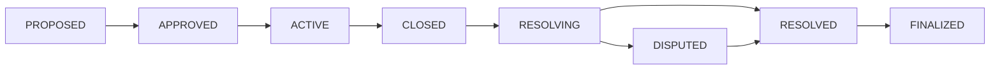

# KEKTECH 3.0 - Live Prediction Market Platform

<div align="center">

## 🟢 LIVE ON MAINNET

**Deployed November 6, 2025 | BasedAI Chain (32323)**

[](https://explorer.basedai.com)
[-success)](./TEST_REALITY.md)
[](./packages/blockchain/audit-results/)
[](https://kektech.vercel.app)

**Decentralized Prediction Markets - Live and Operational**

</div>

---

## 🚀 Quick Links

### Live System
- **Frontend**: [kektech.vercel.app](https://kektech.vercel.app)
- **Contracts**: [View Addresses](./deployments/basedai-mainnet/contracts.json)
- **Documentation**: [CLAUDE.md](./CLAUDE.md)

### Status & Tracking
- **System Status**: [MASTER_STATUS.md](./MASTER_STATUS.md)
- **Current Tasks**: [TODO_TRACKER.md](./TODO_TRACKER.md)
- **Test Status**: [TEST_REALITY.md](./TEST_REALITY.md)
- **Deployment Info**: [DEPLOYMENT_REALITY.md](./DEPLOYMENT_REALITY.md)

---

## 🎯 Overview

KEKTECH 3.0 is a **live, operational** prediction market platform on BasedAI blockchain, featuring:

### Deployed Infrastructure
- ✅ **9 Core Contracts** - Live on mainnet since Nov 6, 2025
- ✅ **100% Test Coverage** - 320/320 tests passing (Nov 8, 2025)
- ✅ **Security Audited** - 96/100 score, 0 critical issues
- ✅ **Gas Optimized** - $0.0001/bet (1000x cheaper than competitors)
- ✅ **Frontend Integrated** - Full UI at kektech.vercel.app

### Technical Architecture
- **EIP-1167 Clone Pattern** - Immutable markets via minimal proxies
- **LMSR Bonding Curves** - Logarithmic Market Scoring Rule
- **Registry Architecture** - Clean upgradability without proxies
- **Multi-layer Security** - Economic + access control + time-based

---

## 📊 Performance Metrics

| Metric | Value | Status |
|--------|-------|--------|
| **Test Coverage** | 100% (320/320) | ✅ |
| **Security Score** | 96/100 | ✅ |
| **Gas per Bet** | ~100k ($0.0001) | ✅ |
| **Market Creation** | ~687k gas | ✅ |
| **Contract Size** | <24KB (max 13KB) | ✅ |
| **Deployment** | Nov 6, 2025 | ✅ |

---

## 🏗️ Architecture

### Deployed Contracts (BasedAI Mainnet)

```
VersionedRegistry (Version Management)
    |
    └─> PredictionMarketTemplate (Cloneable)
           |
           v
FlexibleMarketFactoryUnified
    |
    ├─> Creates Market Clones (EIP-1167)
    |
    v
Market Instances (Immutable)
    ├─> Market 1
    ├─> Market 2
    └─> Market N

Supporting Contracts:
├── ParameterStorage     - Global parameters
├── AccessControlManager - Role management
├── ResolutionManager    - Outcome resolution
├── RewardDistributor    - Fee distribution
└── LMSRCurve           - Pricing algorithm
```

---

## 🚀 Getting Started

### Use the Live System
1. Visit [kektech.vercel.app](https://kektech.vercel.app)
2. Connect wallet (BasedAI network, Chain ID: 32323)
3. Start trading on prediction markets

### Local Development
```bash
# Clone repository
git clone https://github.com/0xBased-lang/kektechV0.69.git
cd kektechV0.69

# Install dependencies
npm install

# Run tests (100% should pass)
cd packages/blockchain
npm test

# Start local fork
npm run node:fork
```

See [Getting Started Guide](./docs/guides/GETTING_STARTED.md) for detailed setup.

---

## 📁 Repository Structure

```
kektechV0.69/
├── packages/
│   ├── blockchain/         # Smart contracts (Solidity)
│   │   ├── contracts/     # Core contracts
│   │   ├── test/          # 320 passing tests
│   │   └── scripts/       # Utility scripts
│   └── frontend/          # Next.js application
│       ├── app/           # App router
│       └── lib/contracts/ # ABIs and addresses
├── deployments/
│   └── basedai-mainnet/   # Live deployment artifacts
├── docs/                  # Documentation
│   ├── guides/           # Developer guides
│   ├── reference/        # API reference
│   └── operations/       # System operations
└── CLAUDE.md             # Main documentation
```

---

## 🔧 Development Commands

```bash
# Testing
npm test                    # Run all tests (100% pass)
npm run test:gas           # Gas usage report
npm run coverage           # Coverage report

# Development
npm run node:fork          # Start mainnet fork
npm run security:slither   # Security analysis

# Scripts
node scripts/live/monitor.js              # Monitor live system
node scripts/live/check-market.js [addr]  # Check market status
```

---

## 📈 Market Lifecycle



---

## 🔐 Security

- **Audit Score**: 96/100 (Slither analysis)
- **Critical Issues**: 0
- **High Issues**: 0
- **Test Coverage**: 100%
- **Reentrancy Protection**: All functions
- **Access Control**: Role-based (RBAC)
- **Immutable Markets**: EIP-1167 clones

---

## 🌟 Key Features

### For Users
- Place bets with BASED tokens
- Create custom prediction markets
- Resolve markets through consensus
- Claim winnings automatically

### For Developers
- Clean, modular architecture
- 100% test coverage
- Comprehensive documentation
- Gas-optimized contracts
- TypeScript SDK (coming soon)

---

## 📊 Testing Parameters

### Quick Testing (Development)
```javascript
{
  marketDuration: 1 hour,
  resolutionTime: 30 minutes,
  disputeWindow: 15 minutes
}
```

### Production (Live Markets)
```javascript
{
  marketDuration: 7-30 days,
  resolutionTime: 24-48 hours,
  disputeWindow: 12-24 hours
}
```

---

## 🤝 Contributing

We welcome contributions! Please see our [Contributing Guide](./CONTRIBUTING.md) for details.

### Development Process
1. Fork the repository
2. Create your feature branch
3. Write tests first (TDD)
4. Implement your feature
5. Ensure 100% test coverage
6. Submit a pull request

---

## 📄 License

MIT License - see [LICENSE](./LICENSE) file for details.

---

## 🔗 Resources

- **Documentation**: [CLAUDE.md](./CLAUDE.md)
- **Architecture**: [docs/architecture/](./docs/architecture/)
- **Contracts**: [docs/reference/CONTRACTS.md](./docs/reference/CONTRACTS.md)
- **Monitoring**: [docs/operations/MONITORING.md](./docs/operations/MONITORING.md)

---

## 📞 Support

- **GitHub Issues**: [Report bugs or request features](https://github.com/0xBased-lang/kektechV0.69/issues)
- **Documentation**: [Complete docs](./CLAUDE.md)
- **Status Updates**: [MASTER_STATUS.md](./MASTER_STATUS.md)

---

<div align="center">

**Built with ❤️ on BasedAI**

**Live Since November 6, 2025**

</div>